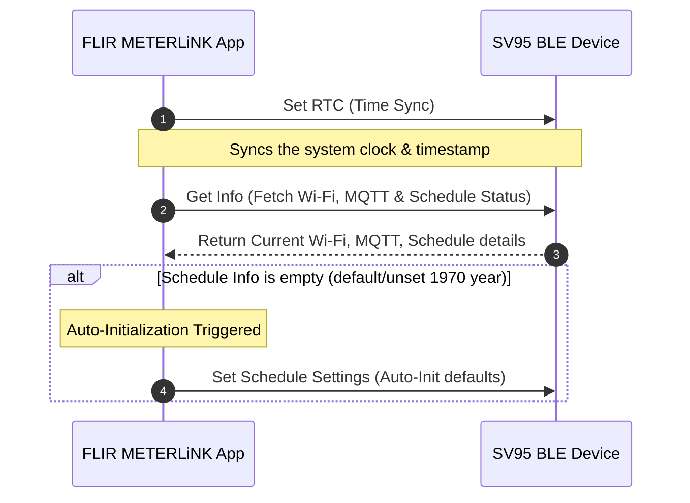

# FLIR METERLiNK Expert Playbook (SV95 Spec)

This skill encapsulates full product and protocol specifications for the SV95 device integration within the FLIR METERLiNK application, based on Confluence Spec `4020273173` and the official Testmo plan.

---

## 1. BLE Connection & Initialization Sequence

When the FLIR METERLiNK App successfully establishes a Bluetooth Low Energy (BLE) connection with an SV95 device, it must follow this exact sequence to ensure proper clock and schedule synchronization:



### Auto-Initialization Defaults (FM-1320, FM-1321, FM-1323)
If `Get Schedule Info` returns empty or indicates factory default settings (timestamp initialized to 1970):
*   **Start Date**: Today's date starting at `00:00:00`.
*   **End Date**: 3 years after the start date.
*   **Active Days**: Monday to Sunday (every day enabled).
*   **Sampling**: 2 seconds.
*   **Interval**: 2 minutes.

### More Page On-Demand Refresh (FM-1341)
Every time a user navigates to the **More** screen within the App, the App must immediately send BLE read requests for:
1.  Get Wi-Fi configuration
2.  Get MQTT configuration
3.  Get Schedule info
This ensures the UI always displays live, on-device status.

---

## 2. Unit Switching & Conversion Rules

Switching units on the **More** page triggers immediate layout changes and data conversions across the app.

### A. Overall Acceleration (OA) Unit (mm/s ↔ inch/s)
*   **UI Update**: Home screen device cards and details page charts must instantly redraw using the new unit.
*   **Threshold Mappings**: Alarm thresholds must scale proportionally.
*   **Lookup Tool**: `python3 skills/vibration-iso-expert/scripts/iso_10816_lookup.py <large|medium|small> <rigid|flexible> <value> <mm/s|inch/s>`

### B. Temperature Unit (°C ↔ °F)
*   **UI Update**: Home screen cards and charts redraw immediately.
*   **CRITICAL RULE**: According to standard App conventions, switching temperature units will **completely clear (reset)** any active temperature alarm settings.

---

## 3. Vibration Alarm Severity (ISO 10816 Thresholds)

Evaluate vibration health for SV95 measurements based on the following three categories. Color codes correspond to threshold crossings:

| Machine Type | Foundation | Alert (mm/s) [Orange] | Danger (mm/s) [Red] | Alert (inch/s) [Orange] | Danger (inch/s) [Red] |
| :--- | :--- | :--- | :--- | :--- | :--- |
| **Large** (e.g. >300kW) | Rigid | 4.5 | 7.1 | 0.18 | 0.28 |
| **Large** (e.g. >300kW) | Flexible | 7.1 | 11.0 | 0.28 | 0.43 |
| **Medium** (15-300kW) | Rigid | 2.8 | 4.5 | 0.11 | 0.18 |
| **Medium** (15-300kW) | Flexible | 4.5 | 7.1 | 0.18 | 0.28 |
| **Small** (<15kW) | Rigid/Flex | 1.8 | 4.5 | 0.07 | 0.18 |

### Alarm Notification Format (FM-1342)
When overall acceleration or temperature crosses Alert or Danger thresholds, trigger a popup banner using this exact copy:
> `%Device_name% meter measurement %value% is higher than [alert|danger] value %alarm_settings%`

---

## 4. No-Device Android Smoke Test Suite (SMK-01 to SMK-15)

Use these test cases when verifying basic application integrity without a physical meter. They focus on permission flows, splash transitions, tutorials, settings, and empty-state handlers.

| ID | Title | Mode | Expected Result / Key Assertions |
|:---|:---|:---|:---|
| **SMK-01** | Splash screen on Phone | Auto | FLIR splash logo displays; app transitions without crash. |
| **SMK-02** | Allow Location Permission | Semi-Auto | Prompts background location warning if needed; continues to Scan. |
| **SMK-03** | Deny Location Permission | Semi-Auto | Scan screen remains empty with a clear guidance banner requesting settings permissions. |
| **SMK-04** | Tutorial Progress | Auto | Tapping `Next` advances slides; OOBE completes successfully and lands on Home. |
| **SMK-05** | Tutorial Interruption | Semi-Auto | App background/foreground cycle preserves the current tutorial slide index. |
| **SMK-06** | Search - No Devices | Auto | Bluetooth active but no devices nearby. Scan page displays standard "no device found" troubleshooting tips. |
| **SMK-07** | Can't Connect Help Flow | Auto | Tapping `Can't connect?` loads internal guide. Tapping `X` successfully returns to search (Android system Back button does NOT exit). |
| **SMK-08** | Bluetooth Disabled warning | Semi-Auto | Attempting to connect prompts user to toggle system Bluetooth. |
| **SMK-09** | Settings - Dark Mode | Auto | UI immediately transforms to a cohesive dark palette. |
| **SMK-10** | Settings - Light Mode | Auto | UI immediately transforms to a cohesive light palette. |
| **SMK-11** | Support - Manual | Semi-Auto | External browser opens the METERLiNK User Manual. |
| **SMK-12** | Support - FLIR Support | Semi-Auto | External browser opens FLIR Support Portal. |
| **SMK-13** | Support - FLIR Website | Semi-Auto | External browser opens standard flir.com homepage. |
| **SMK-14** | Version Info | Auto | Settings screen displays the correct semantic version number. |
| **SMK-15** | English UI Enforcement | Auto | When the system locale is set to Traditional Chinese, the application strings must remain in English. |

---

## 5. Automation CLI Guide

Automation scripts are structured around a common runner.

*   **Primary CLI**: [scripts/flir_android_smoke.py](file:///Users/alex/Documents/Project/FLIR_METERLiNK/scripts/flir_android_smoke.py)
*   **Source Code Packages**: [scripts/flir_android/](file:///Users/alex/Documents/Project/FLIR_METERLiNK/scripts/flir_android)

### Quick Commands
```bash
# Run a specific suite (e.g. OOBE flows)
python3 scripts/flir_android_smoke.py --case oobe-suite

# Run mock profile cases locally
cp scripts/flir_android/mock_profile.example.json scripts/flir_android/mock_profile.json
python3 scripts/flir_android_smoke.py --case mock-suite --mock-profile scripts/flir_android/mock_profile.json

# Run individual cases
python3 scripts/flir_android_smoke.py --case cant-connect
python3 scripts/flir_android_smoke.py --case oobe-allow
```

### Automation Log & XML Dump Artifacts
Each run dumps its artifacts into `artifacts/android_smoke/` including screenshots, UI XML hierarchies, and `results.json`.
